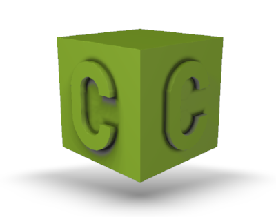

=============================================================
CodeCad: A programming CAD based on signed distance functions
=============================================================
Inspired by OpenSCAD and ImplicitCad, implemented in Python using OpenCL for
computing power.

Currently CodeCad consists mostly of an API for representing and manipulating geometry
using CSG operations and exports to STL and image.
There is also a simple part/assembly model and BOM generator.

Goals
-----
At this stage the main goal is to have usability on par with OpenSCAD.
We're not there yet, although some useable models can already be created.

In the long term this should have a working GUI and parametric sketch tools.

Who knows what's next. Maybe turning this into a slicer?

Requirements
------------
The main requirement to run CodeCad is a working OpenCL implementation.
Your GPU should provide one, or try `POCL <(http://portablecl.org>`_.

CodeCad might work on Windows, but it hasn't been tested.

Example Code
------------
The cube at the beginning of this file was generated by the following piece of code:

.. code:: python
    import codecad
    from codecad.shapes import *

    def c_generator(width, stroke):
        r = rectangle(width, 1 - width + stroke / 2)
        c = (r
             + circle(d=width).translated_y((1 - width) / 2)
             + circle(d=width).translated_y(-(1 - width) / 2))
        c = c.shell(stroke)
        c -= rectangle(width, 1 - width).translated_x(width / 2)
        return c

    c = c_generator(0.6, 0.2) \
        .scaled(0.6) \
        .extruded(0.12) \
        .rotated_x(90) \
        .translated_y(-0.5)

    logo = box() + c + c.rotated_z(90)
    logo = logo \
        .scaled(100) \
        .rotated_z(-45) \
        .rotated_x(15)

    codecad.commandline_render(logo)

